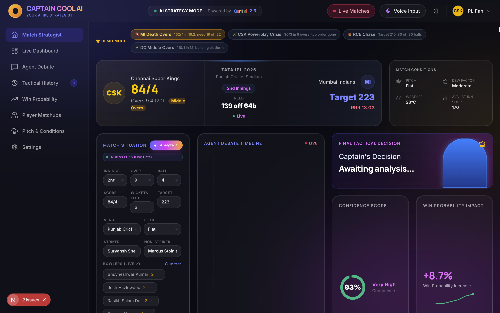
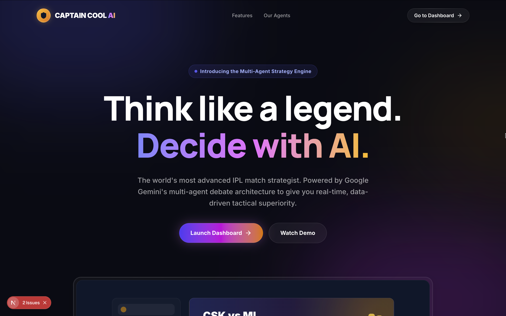

# Captain Cool AI / Third Umpire AI 🏏🤖

**The world's most advanced IPL match strategist. Powered by Google Gemini's multi-agent debate architecture to give you real-time, data-driven tactical superiority.**



## Overview

Captain Cool AI doesn't just use one model. It uses a specialized ensemble of distinct analytical personas that debate each other to arrive at the perfect tactical move in live cricket matches (specifically IPL & T20s).

By hooking directly into live Cricbuzz data streams, the system evaluates match situations, pitch conditions, and player form in milliseconds, simulating the tactical genius of legendary captains like MS Dhoni.



## 🌟 Key Features

*   **Real-Time Data Ingestion:** Connects instantly to live scorecard data to give you the active match state (score, RRR, active bowlers, strikers).
*   **Multi-Agent Debate Architecture:** 
    *   📊 **Data Analyst Agent:** Crunches numbers, matchups, and strike rates.
    *   🌤️ **Pitch & Conditions Agent:** Reads the venue, dew factor, and history.
    *   🧠 **Tactical Mastermind:** Synthesizes everything into a brilliant masterstroke.
*   **Win Probability Modeling:** Dynamic curve predictions mapping every ball's impact on your chances of victory.
*   **Premium Glassmorphism UI:** Built with Next.js, Tailwind CSS, and Framer Motion-inspired animations for a world-class SaaS experience.
*   **Voice Interactions:** Experimental voice input for hands-free queries.

## 🚀 Getting Started

First, install the dependencies:

```bash
npm install
```

Set up your environment variables by creating a `.env.local` file:
```env
GEMINI_API_KEY=your_google_gemini_api_key
RAPIDAPI_KEY=your_cricbuzz_rapidapi_key
```

Then, run the development server:

```bash
npm run dev
```

Open [http://localhost:3000](http://localhost:3000) with your browser to see the result. The main dashboard is located at `/dashboard`.

## 🛠️ Tech Stack
*   **Frontend:** Next.js 16 (App Router), React, Tailwind CSS, Lucide Icons
*   **Backend:** Next.js API Routes
*   **AI Engine:** Google Gemini Advanced Models
*   **Data Source:** Cricbuzz API (via RapidAPI)

---

### Created by [Digital Pritam](https://www.digitalpritam.in) 
*Built for the Google Gemini AI Hackathon.*
